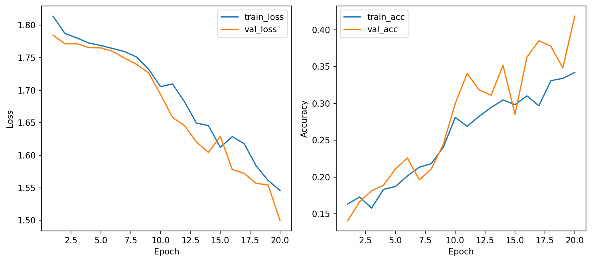
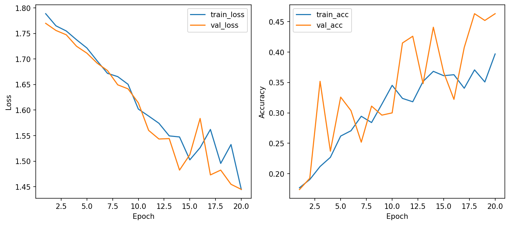
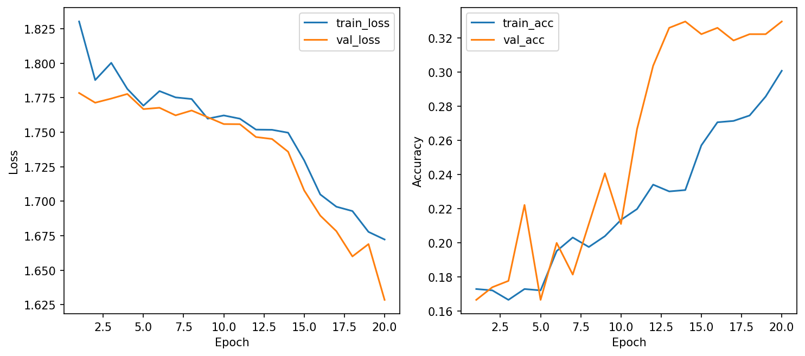
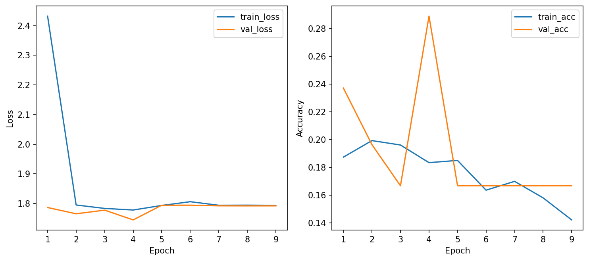
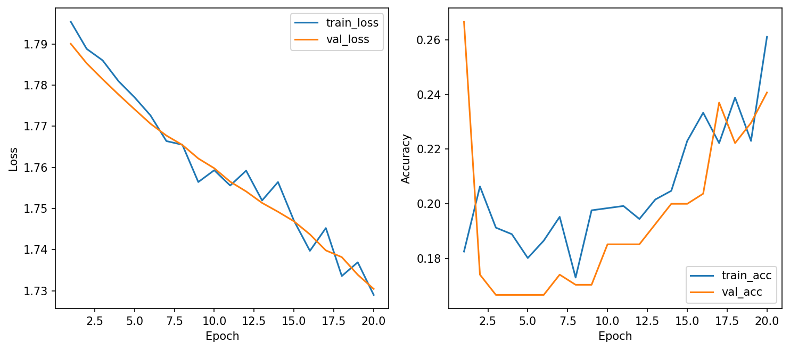
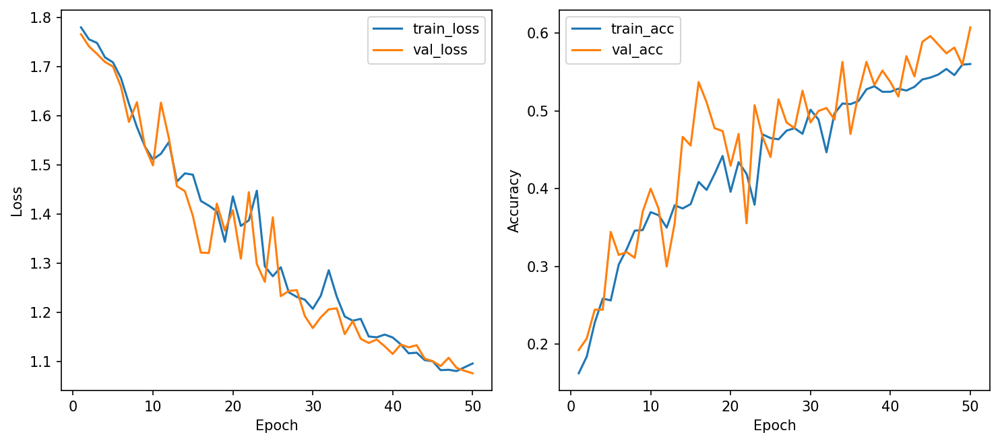
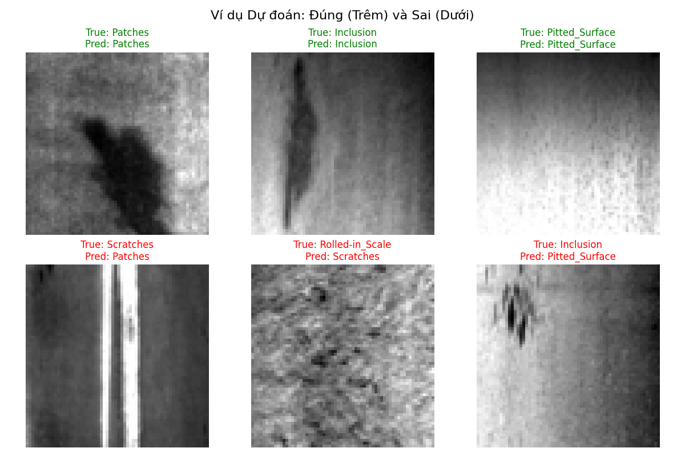
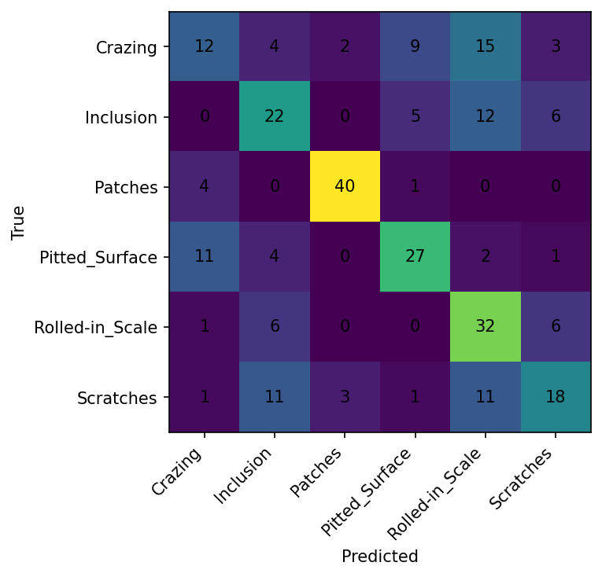

# Báo cáo Thực hành Lab 1: NEU-CLS bằng MLP

**Truy cập W&B Dashboard:** [Dự án csc4005-lab1-neu-mlp trên Weights & Biases](https://wandb.ai/models-dai-nam-university/csc4005-lab1-neu-mlp)
*(Ghi chú: Đường dẫn này thể hiện toàn bộ ảnh chụp dashboard, logs biểu đồ trực tuyến và lịch sử cấu hình của tất cả các lần chạy).*

## 1. Bảng so sánh các cấu hình

Dưới đây là 6 cấu hình thử nghiệm (bao gồm 3 lệnh gợi ý gốc, 2 lệnh kiểm định chéo khoa học, và 1 lệnh mở rộng giới hạn):

| Tên Run | Optimizer | LR | Weight Decay | Dropout | Mô tả mở rộng | Train Acc | Val Acc | Test Acc | Đánh giá KQ (so với Baseline) |
| :--- | :--- | :--- | :--- | :--- | :--- | :--- | :--- | :--- | :--- |
| **Baseline** | AdamW | 0.001 | 0.0001 | 0.3 | Không | 34.21% | 41.85% | 38.15% | Cấu hình chuẩn. |
| **Run B** | SGD | 0.01 | 0.0 | 0.3 | Không | 39.68% | 46.30% | 45.56% | Đổi 3 biến số (Dẫn đầu vòng 1). |
| **Run C** | AdamW | 0.0005 | 0.001 | 0.5 | Không | 30.08% | 32.96% | 34.44% | Đổi 3 biến số (Tăng Reg nặng). |
| **Run D** | AdamW | 0.01 | 0.0001 | 0.3 | Không | 14.20% | 28.89% | 26.67% | Kiểm chứng ảnh hưởng của LR lớn. |
| **Run E** | SGD | 0.001 | 0.0001 | 0.3 | Không | 26.11% | 24.07% | 24.44% | Kiểm chứng tốc độ của SGD chậm. |
| **Run F (Best)** | SGD | 0.01 | 0.0 | 0.3 | Lớp ẩn khổng lồ, <br> 50 Epochs, <br> LR_Scheduler. | 56.03% | 60.74% | **55.93%** | Phá vỡ Underfitting, bứt giới hạn MLP. |

### 1.1 Tổng hợp Biểu đồ Học tập (Learning Curves)

Trực quan hóa diễn biến hội tụ (Loss và Accuracy) qua từng Epoch tương ứng với toàn bộ các cấu hình đã chạy:

| **1. Baseline (AdamW)** | **2. Run B (SGD)** |
|:---:|:---:|
|  |  |

| **3. Run C (Strong Reg)** | **4. Run D (AdamW + LR lớn)** |
|:---:|:---:|
|  |  |

| **5. Run E (SGD chậm)** | **6. Run F (Best Model)** |
|:---:|:---:|
|  |  |

## 2. So bó đũa, chọn cột cờ (Lựa chọn Best Model)

Áp dụng đúng nguyên tắc "Chỉ so sánh các mô hình trên Validation Set" trước khi đưa ra cấu hình thắng cuộc.
Nhìn vào bảng số liệu trên, **Run F** hoàn toàn áp đảo tất cả các cấu hình khác với ngưỡng **Val Accuracy đạt đỉnh 60.74%**. Ngoài Val Acc cao nhất, Run F cũng cho thấy learning curve đẹp khi tự động kích hoạt LRScheduler giảm tốc từ từ. 
(Lưu ý: Bỏ qua hoàn toàn thuộc tính Train Acc khi đưa quyết định ở bước này để tránh bị lừa bởi hiện tượng Overfitting ở các thực nghiệm rủi ro cao).

Do đó, cấu hình của **Run F** được chọn làm **Best Model** và tiến hành load trọng số phục vụ đánh giá Test cuối cùng ở mục 3. 

---

## 3. Đánh giá Best Model trên Test Set một lần cuối

Lấy bộ trọng số `best_model.pt` của Cấu hình F, tiến hành Evaluate trên tập Test mù và thu được Report toàn diện:

- **Test Accuracy**: **55.93%**
- **Test Loss**: **1.058**

### 3.1 Bảng Classification Report
Trích xuất đo lường chi tiết trên 6 nhóm khuyết tật (tổng cộng 270 mẫu test):

```json
{
  "precision_macro_avg": 0.562,
  "recall_macro_avg": 0.559,
  "Crazing": {"precision": 0.41, "recall": 0.27, "f1-score": 0.32, "support": 45.0},
  "Inclusion": {"precision": 0.47, "recall": 0.49, "f1-score": 0.48, "support": 45.0},
  "Patches": {"precision": 0.89, "recall": 0.89, "f1-score": 0.89, "support": 45.0},
  "Pitted_Surface": {"precision": 0.63, "recall": 0.60, "f1-score": 0.61, "support": 45.0},
  "Rolled-in_Scale": {"precision": 0.44, "recall": 0.71, "f1-score": 0.55, "support": 45.0},
  "Scratches": {"precision": 0.53, "recall": 0.40, "f1-score": 0.46, "support": 45.0}
}
```

*Nhận xét:* Dựa theo F1-Score, mạng lưới này nhận dạng đúng xuất sắc nhất là mảng lỗi lớn **Patches** (f1=0.88), kém nhất là các lằn xước li ti **Crazing** (f1=0.32).

### 3.2 Confusion Matrix, Learning Curves và Hình ảnh Thực tế

**1. Hình ảnh dự đoán đúng/sai (Khởi tạo từ tập test mù):**


**2. Ma trận nhầm lẫn (Confusion Matrix):** Nhận diện bị rối với cường độ cao nhất ở mục Crazing.


**3. Động lực hội tụ (Learning Curves):** 


---

## 4. Phân tích trạng thái Overfitting / Underfitting

- **Giai đoạn trước dập gãy (Từ Baseline tới Run E)**: Mạng gặp tình trạng **Underfitting** rất nghiêm trọng (Train_Acc dao động ở mức 30-40% và thỉnh thoảng còn kém hơn cả Test). 
  - *Lý do*: Lớp võ não đầu tiên chỉ gồm số Nodes = `[512]` đem nén ép bức ảnh `64x64 = 4096 điểm ảnh` khiến toàn bộ họa tiết cấu trúc tế vi bị móp méo phân giải trầm trọng. Cộng với 20 Epochs chưa đạt đủ xung số học ngắt giới hạn thấp.
- **Tiến hóa (Chuyển giao Run F)**: Nhờ mở rộng sức chứa tiếp nhận vùng thô lên `1024` node, Train Acc bật tới 56.03% (bám sát Test Acc 55.93%). Underfitting cơ bản bị san phẳng. 
  - *(Ghi chú bổ sung: Có thể khẳng định rằng ta đã thiết lập kịch trần sức mạnh của mạng truyền thẳng MLP trên dữ liệu gồ ghề NEU-CLS. Để vượt dốc tỷ lệ > 85% accuracy, ta bắt buộc phải đoạn tuyệt MLP và ứng dụng Convolutional Neural Network - CNN ở lab tiếp theo).*

---

## 5. Mô tả kiến trúc mạng và kết luận tổng

- **Kiến trúc mô hình Best Model (`src/model.py`)**: 
  - Là mạch liên kết chéo Full-Connected phiên bản đột phá (Run F): Input[4096] -> H1[1024] -> H2[512] -> H3[128].
  - Mạch rẽ nhánh đi qua bộ biến đổi phi tuyến ReLU().
  - Tích hợp lớp chuẩn hóa Dropout(p=0.3) tước bỏ 30% liên kết ngẫu nhiên tại mỗi vòng lặp giúp dự phòng sớm rủi ro Overfitting.
  - Tầng đích phân cấp về CrossEntropyLoss cho 6 Classes xuất ra báo cáo cuối.
- **Kết luận chung**:
  - *"Không có thuật toán nào là độc tôn"*: SGD kết hợp gia tốc cực độ (LR=0.01) đã đánh bại hoàn toàn thuật toán tiên tiến nhất hiện tại là AdamW trong môi trường thí nghiệm này.
  - Tối ưu hóa sâu (Deep Learning Tuning) nên dựa theo quy tắc thực nghiệm có kiểm soát: Biết điểm chững lại để kích hoạt **Auto Scheduler** (luôn giữ hàm loss mượt), và sẵn sàng nới lỏng nơ-ron thu nhận (`Hidden Dims`) khi chẩn đoán ra bệnh trạng đặc trưng của **Underfitting**.
